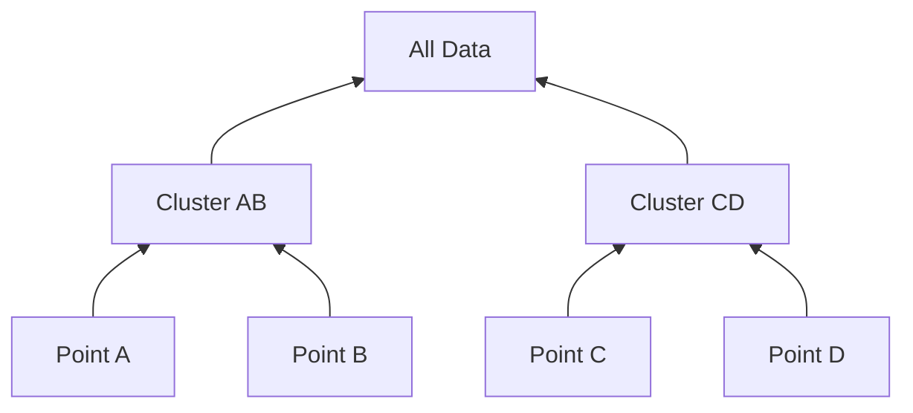

# Agglomerative (Bottom-Up) Clustering

## Overview
Agglomerative clustering initializes execution by treating every individual data point as its own solitary cluster.

## Detailed Information
- **Mechanism:** It enters a recursive loop that continuously merges the two closest clusters together until only one unified root cluster remains.
- **Complexity:** Has a high memory footprint ($O(N^2)$ complexity) due to the necessity of maintaining a massive, updating proximity matrix.
- **Year First Used:** 1958
- **Foundational Paper:** [A statistical method for evaluating systematic relationships](https://biostor.org/reference/11545)

## Diagram

[Back to README](../README.md)
