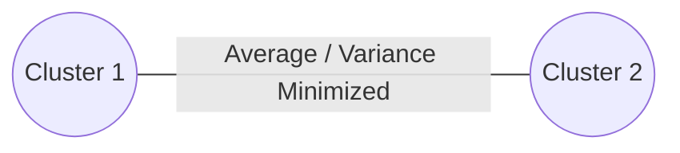

# Average / Ward's Linkage

## Overview
Linkage methods that minimize variance or compute average distances rather than extreme minimums or maximums.

## Detailed Information
- **Metric:** Computes the average distance between all pairs, or minimizes the total within-cluster variance step-by-step (Ward's method).
- **Status:** The industry-standard choice for robust, noise-resistant recursive grouping profiles.
- **Year First Used:** 1963
- **Foundational Paper:** [Hierarchical Grouping to Optimize an Objective Function](https://doi.org/10.1080/01621459.1963.10500845)

## Diagram

[Back to README](../README.md)
