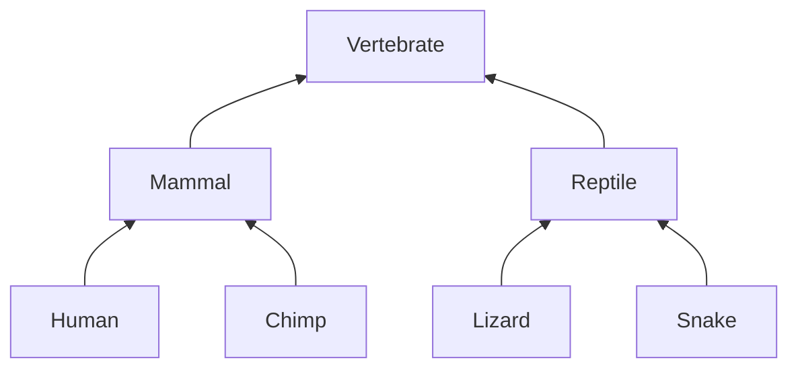

# Bioinformatics & Phylogenetic Tree Construction

## Overview
Recursive clustering outputs an explicit, multi-scale tree structure (a Dendrogram), which is the premier choice for domains requiring explicit ancestral tracking and taxonomy.

## Detailed Information
- **Application:** Used to build evolutionary family trees. By calculating genetic sequence alignments across organisms, recursive clustering groups species by ancestral divergence points, mapping mutations over time.
- **Year First Used:** 1967
- **Foundational Paper:** [Phylogenetic Analysis: Models and Estimation Procedures](https://www.jstor.org/stable/2406616)

## Diagram

[Back to README](../README.md)
