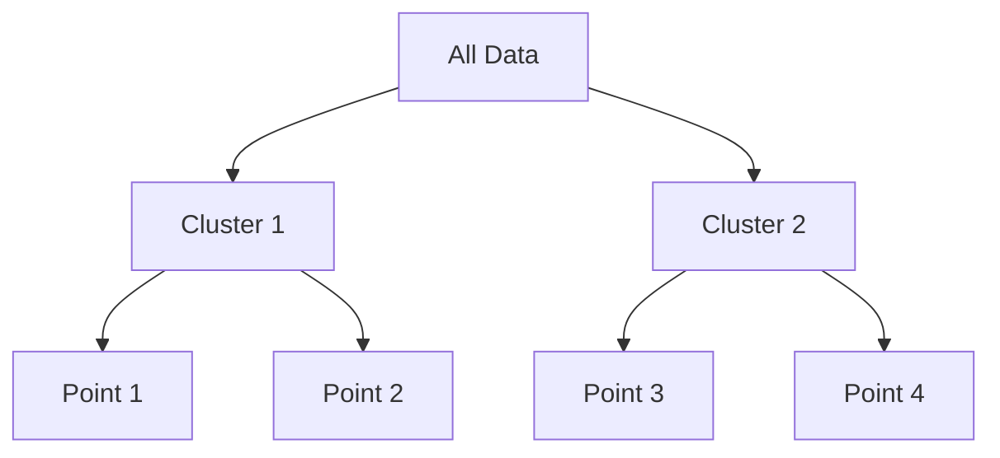

# Classic Hierarchical Clustering (AGNES / DIANA)

## Overview
Classic Hierarchical Clustering encompasses both agglomerative (bottom-up) and divisive (top-down) approaches. These algorithms build a nested hierarchy of clusters by either merging small clusters or splitting large ones, using proximity measures such as Euclidean distance.

## Detailed Information
- **AGNES (Agglomerative Nesting):** Starts with individual points and merges the closest ones.
- **DIANA (Divisive Analysis):** Starts with a single cluster containing all points and recursively splits them.
- **Year First Used:** 1990
- **Foundational Paper:** [Finding Groups in Data](https://doi.org/10.1002/9780470316801)

## Diagram

[Back to README](../README.md)
