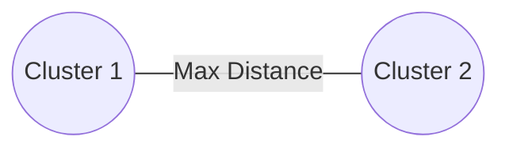

# Complete Linkage (Maximum Distance)

## Overview
A linkage criterion where the distance between two clusters is defined as the maximum distance between any single data point in the first cluster and any single data point in the second cluster.

## Detailed Information
- **Metric:** Measures the distance between the two furthest points belonging to separate clusters.
- **Behavior:** Forces the generation of tightly packed, highly spherical cluster shapes.
- **Year First Used:** 1948
- **Foundational Paper:** [A method of establishing groups of equal amplitude in plant sociology...](https://cir.nii.ac.jp/crid/1570854174069828224)

## Diagram

[Back to README](../README.md)
