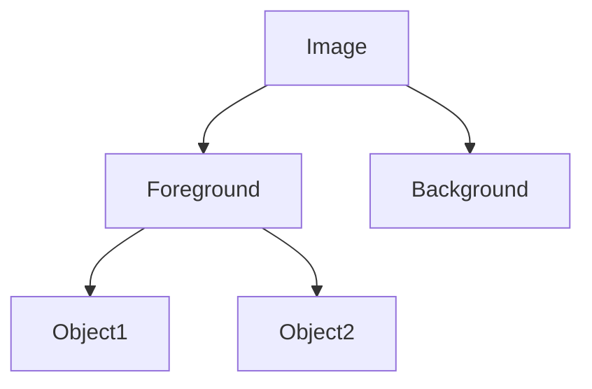

# Computer Vision & Image Segmentation Trees

## Overview
Recursive clustering methods applied to visual data to slice image frames into distinct object components.

## Detailed Information
- **Application:** Slices image frames into object components. Recursive spectral clustering maps pixels to a spatial graph and splits it sequentially—first separating the foreground from the background, then breaking the foreground into individual distinct objects.
- **Year First Used:** 2000
- **Foundational Paper:** [Normalized Cuts and Image Segmentation](https://doi.org/10.1109/34.868688)

## Diagram

[Back to README](../README.md)
