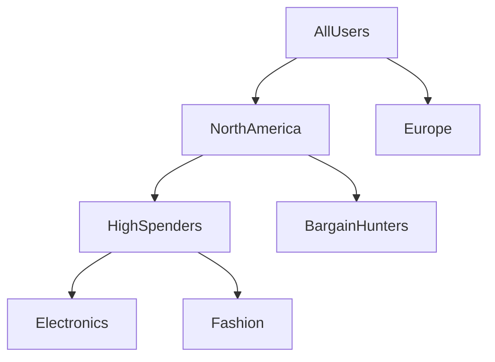

# Customer Personalization & Micro-Targeting Taxonomies

## Overview
Using recursive tree architectures in e-commerce and marketing to systematically segment target markets.

## Detailed Information
- **Application:** E-commerce platforms use recursive tree architectures to segment markets. High-level splits group users by raw geographical region, while deep recursive sub-branches isolate micro-cohorts based on highly specific shopping behaviors and purchase histories.
- **Year First Used:** 1997
- **Foundational Paper:** [Database Marketing: Past, Present, and Future](https://doi.org/10.1080/10495142.1997.10753702)

## Diagram

[Back to README](../README.md)
