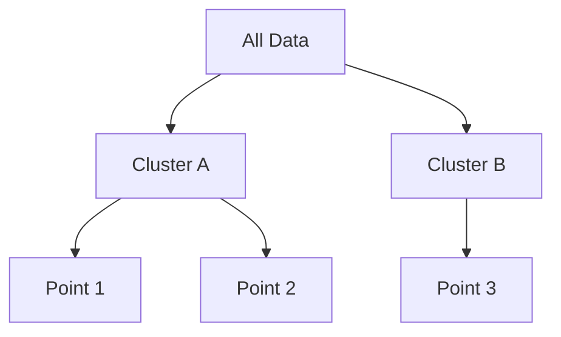

# Divisive (Top-Down) Clustering

## Overview
Begins with the entire dataset contained inside a single, massive root cluster, and recursively splits it.

## Detailed Information
- **Mechanism:** It recursively applies a flat clustering engine (like 2-way $K$-means) to split clusters into smaller segments until every data point is completely isolated.
- **Pros:** Highly efficient at discovering macro-level structural boundaries early in the execution timeline.
- **Year First Used:** 1964
- **Foundational Paper:** [Dissimilarity analysis: a new technique of hierarchical sub-division](https://doi.org/10.1038/2021034a0)

## Diagram

[Back to README](../README.md)
