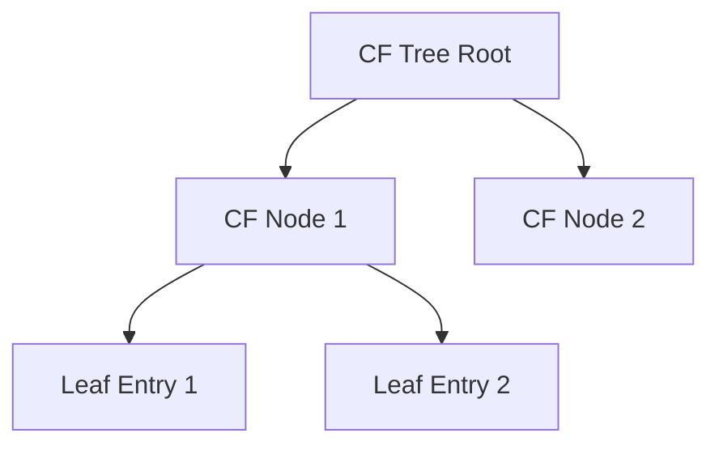

# Scalable Memory-Bounded Trees (BIRCH / CURE)

## Overview
These algorithms address the memory limitations and computational bottlenecks ($O(N^2)$) of classic hierarchical clustering, introducing tree-building features to compress streaming raw data.

## Detailed Information
- **BIRCH:** Uses a Clustering Feature (CF) Tree to summarize data distribution.
- **CURE:** Represents clusters using a set of well-scattered representative points.
- **Year First Used:** 1996
- **Foundational Paper:** [BIRCH: An Efficient Data Clustering Method for Very Large Databases](https://doi.org/10.1145/233269.233324)

## Diagram

[Back to README](../README.md)
