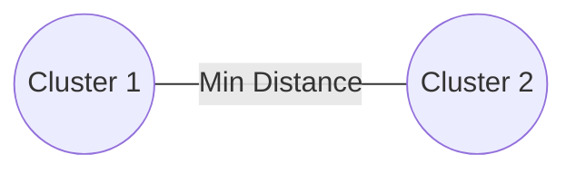

# Single Linkage (Minimum Distance)

## Overview
A linkage criteria for hierarchical clustering where the distance between two clusters is defined as the minimum distance between any single data point in the first cluster and any single data point in the second cluster.

## Detailed Information
- **Metric:** Measures the distance between the two closest individual points belonging to separate clusters.
- **Limitation:** Highly prone to the **chaining effect**, where long, thin, trailing noise lines artificially bridge two completely distinct clusters together.
- **Year First Used:** 1951
- **Foundational Paper:** [Sur la liaison et la division des points d'un ensemble fini](https://eudml.org/doc/213233)

## Diagram

[Back to README](../README.md)
