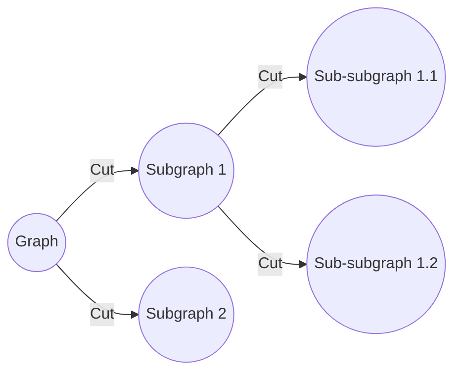

# Recursive Bi-Partitioning & Spectral Graph Cuts

## Overview
This method models data as a connected graph and uses a recursive cut algorithm to slice the graph along its minimum bottlenecks, typically utilizing Laplacian eigenvectors.

## Detailed Information
- **Concept:** Shifts from raw Euclidean distances to network topology.
- **Technique:** Identifies the "weakest links" in the data graph to perform recursive bi-partitioning.
- **Year First Used:** 2000
- **Foundational Paper:** [Normalized Cuts and Image Segmentation](https://doi.org/10.1109/34.868688)

## Diagram

[Back to README](../README.md)
